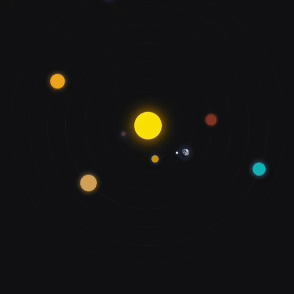

# Sistema Solar Simples

[Gabriel Soares](https://www.linkedin.com/in/gabriel-soares-3098782b0/)

---

## Sobre
Este projeto consiste em uma visualização simples do **Sistema Solar**, representando os planetas do nosso sistema de maneira simplificada e com uma visão de cima.

---

## Funcionalidades
1. Visualização simplificada dos planetas do Sistema Solar
2. Movimento orbital animado dos planetas ao redor do Sol
3. Representação simplificada dos planetas e suas órbitas

---

## Tecnologias utilizadas
- **HTML**
- **CSS**
- **JavaScript**
- **Markdown**
- **Git**

